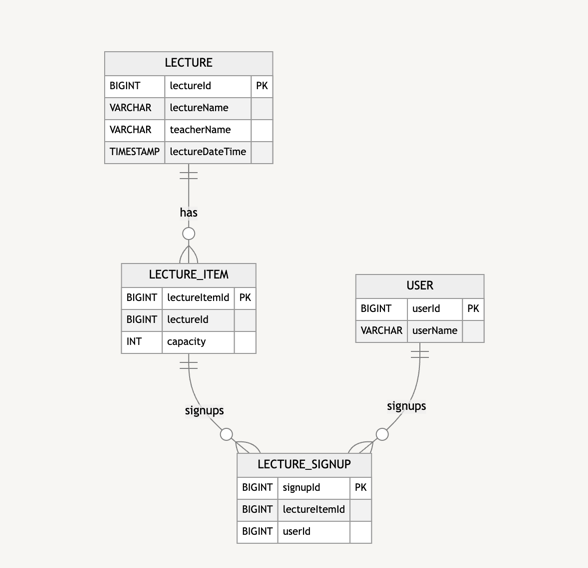
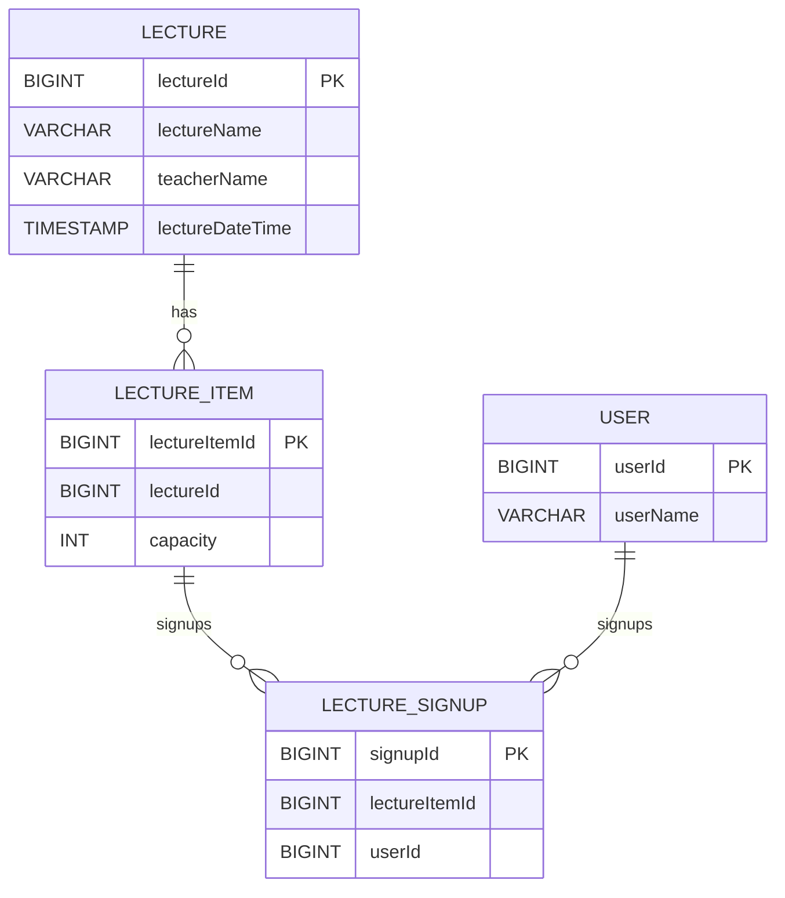

ERD



```mermaid
erDiagram

LECTURE {

BIGINT lectureId PK

VARCHAR lectureName

VARCHAR teacherName

TIMESTAMP lectureDateTime

}

LECTURE_ITEM {

BIGINT lectureItemId PK

BIGINT lectureId 

INT capacity

}

%% Unique constraint (userId, lectureItemId) on LECTURESIGNUP

LECTURE_SIGNUP {

BIGINT signupId PK

BIGINT lectureItemId 

BIGINT userId 

}

USER {

BIGINT userId PK

VARCHAR userName

}

  

LECTURE ||--o{ LECTURE_ITEM : has

LECTURE_ITEM ||--o{ LECTURE_SIGNUP : signups

USER ||--o{ LECTURE_SIGNUP : signups

```

```text
강좌-강좌아이템을 나눈 이유?
강좌 정원을 확인하거나 차감하는 로직에서 동시성을 제어하기 위해서 락이 필요한데, 강좌의 모든 정보를 한 테이블에 담으면 강좌에 해당하는 기본정보(강좌명, 강사이름 등)만 조회하고 싶을때에도 락에 걸리기 때문에 성능 향상을 위해 정규화를 하였습니다
```
